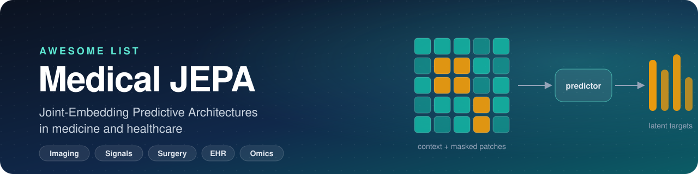
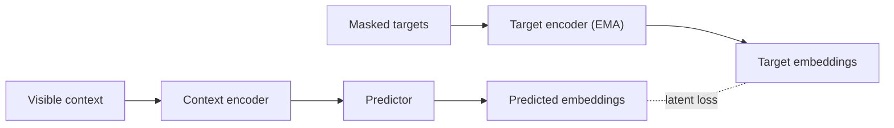

<!-- This file is generated by scripts/build_readme.py from data/papers.csv. Do not edit it by hand. -->

<div align="center">



# Awesome Medical JEPA

[](https://awesome.re)
[](#contents)
[](#how-to-read-this-list)
[](../../commits/main)
[](CONTRIBUTING.md)
[](LICENSE)

A curated list of papers and code that use **Joint-Embedding Predictive Architectures (JEPA)**, including I-JEPA, V-JEPA and LeJEPA,<br>
for self-supervised learning in medicine and healthcare: medical imaging, physiological signals, surgical video, EHR and molecular biology.

**[🌐 Website](https://big-matrix-r-and-d-lab.github.io/Awesome-Medical-JEPA/)** &nbsp;·&nbsp; **[Browse papers](#contents)** &nbsp;·&nbsp; **[What is a JEPA?](#what-is-a-jepa)** &nbsp;·&nbsp; **[Add a paper](../../issues/new?template=add-paper.yml)** &nbsp;·&nbsp; **[Contribute](#contributing)**

</div>

## What is a JEPA?

A JEPA learns representations by *predicting in latent space*. A context encoder embeds a visible part of the input. A predictor then estimates the embeddings of masked or future target regions, which a separate target encoder (typically an EMA of the context encoder) produces. The model never reconstructs pixels or raw signal values, so it can concentrate on semantic structure and ignore low-level noise. That makes it a natural fit for medical data, where much of the variance in the raw input is acquisition noise.



The original formulations are I-JEPA for images and V-JEPA for video; they are listed under [Foundations](#-foundations).

## How to read this list

| Tag | Inclusion type | Meaning |
| :---: | --- | --- |
| | **Direct Medical JEPA** | Applies or extends a JEPA objective on medical or biomedical data. |
| 🔸 | **JEPA-inspired Medical** | Adapts JEPA ideas (e.g. latent feature prediction) without being a named JEPA, or benchmarks JEPA against other objectives. |
| | **Foundational JEPA** | General-domain architectures and theory that medical JEPA work builds on. |

> [!NOTE]
> The **Code** column links only to **official** implementations released by the authors, with live GitHub stars. Third-party re-implementations are deliberately not listed, and `—` means no official code was located at curation time. Venues shown as *arXiv* or *bioRxiv* are preprints that have not (yet) been peer reviewed.

## At a glance

**43** papers &nbsp;·&nbsp; **16** with official code &nbsp;·&nbsp; **6** research areas

| Year | Papers | |
| :-- | --: | :-- |
| 2023 | 1 | █ |
| 2024 | 5 | ████ |
| 2025 | 7 | ██████ |
| 2026 | 30 | ████████████████████████ |

## Contents

| | Area | Papers | Sections |
| :-: | :-- | :-: | :-- |
| 🧱 | **[Foundations](#-foundations)** | 5 | [Architectures](#architectures)&nbsp;<sub>3</sub> · [Theory & Objectives](#theory--objectives)&nbsp;<sub>2</sub> |
| 🩻 | **[Medical Imaging](#-medical-imaging)** | 18 | [Radiology](#radiology)&nbsp;<sub>4</sub> · [Neuroimaging](#neuroimaging)&nbsp;<sub>8</sub> · [Cardiac Imaging](#cardiac-imaging)&nbsp;<sub>2</sub> · [Ultrasound](#ultrasound)&nbsp;<sub>3</sub> · [Computational Pathology](#computational-pathology)&nbsp;<sub>1</sub> |
| 🎥 | **[Surgical Video](#-surgical-video)** | 2 | — |
| 💓 | **[Physiological Signals](#-physiological-signals)** | 13 | [ECG](#ecg)&nbsp;<sub>4</sub> · [EEG](#eeg)&nbsp;<sub>4</sub> · [Multimodal & ICU Monitoring](#multimodal--icu-monitoring)&nbsp;<sub>5</sub> |
| 📋 | **[EHR & Clinical Trajectories](#-ehr--clinical-trajectories)** | 2 | — |
| 🧬 | **[Molecular & Single-Cell Biology](#-molecular--single-cell-biology)** | 3 | — |

## 🧱 Foundations

### Architectures

| Model | Paper | Venue | Code |
| :-- | :-- | :-: | :-: |
| **V‑JEPA&nbsp;2** | [V-JEPA 2: Self-Supervised Video Models Enable Understanding, Prediction and Planning](https://arxiv.org/abs/2506.09985)<br><sub><code>Video</code> Video understanding, prediction and planning</sub> | arXiv<br><sub>2025</sub> | [](https://github.com/facebookresearch/vjepa2) |
| **V‑JEPA** | [Revisiting Feature Prediction for Learning Visual Representations from Video](https://arxiv.org/abs/2404.08471)<br><sub><code>Video</code> Self-supervised video representation learning</sub> | TMLR<br><sub>2024</sub> | [](https://github.com/facebookresearch/jepa) |
| **I‑JEPA** | [Self-Supervised Learning from Images with a Joint-Embedding Predictive Architecture](https://arxiv.org/abs/2301.08243)<br><sub><code>Images</code> Self-supervised visual representation learning</sub> | CVPR<br><sub>2023</sub> | [](https://github.com/facebookresearch/ijepa) |

<p align="right"><a href="#contents"><sub>↑ back to top</sub></a></p>

### Theory & Objectives

| Model | Paper | Venue | Code |
| :-- | :-- | :-: | :-: |
| **LeJEPA** | [LeJEPA: Provable and Scalable Self-Supervised Learning Without the Heuristics](https://arxiv.org/abs/2511.08544)<br><sub><code>General representations</code> Theory and scalable self-supervised objective</sub> | arXiv<br><sub>2025</sub> | [](https://github.com/galilai-group/lejepa) |
| **Deep linear self-distillation networks** | [How JEPA Avoids Noisy Features: The Implicit Bias of Deep Linear Self Distillation Networks](https://arxiv.org/abs/2407.03475)<br><sub><code>Images / representations</code> Analyze JEPA-related implicit bias and noisy features</sub> | NeurIPS<br><sub>2024</sub> | — |

<p align="right"><a href="#contents"><sub>↑ back to top</sub></a></p>

## 🩻 Medical Imaging

### Radiology

| Model | Paper | Venue | Code |
| :-- | :-- | :-: | :-: |
| **AEGIS** | [AEGIS: A Multi-Task Joint-Embedding Predictive Architecture for Mammography](https://arxiv.org/abs/2607.00277)<br><sub><code>Mammography</code> Breast cancer detection and density assessment</sub> | arXiv<br><sub>2026</sub> | — |
| **Rad‑JEPA&nbsp;3D** | [Rad-JEPA 3D: Radiology Joint-Embedding Predictive Model for 3D Computed Tomography](https://arxiv.org/abs/2607.26196)<br><sub><code>3D CT</code> Volumetric radiology representation learning</sub> | arXiv<br><sub>2026</sub> | — |
| **RadJEPA** | [RadJEPA: Radiology Encoder for Chest X-Rays via Joint Embedding Predictive Architecture](https://arxiv.org/abs/2601.15891)<br><sub><code>Chest X-ray</code> Radiology report generation and transfer classification/segmentation</sub> | EMNLP<br><sub>2026</sub> | [](https://github.com/aidelab-iitbombay/RadJEPA) |
| **Multimodal imaging–clinical JEPA** | [Self-Supervised Learning of Imaging and Clinical Signatures Using a Multimodal Joint-Embedding Predictive Architecture](https://arxiv.org/abs/2509.15470)<br><sub><code>CT + longitudinal EHR</code> Nodule diagnosis / multimodal clinical prediction</sub> | arXiv<br><sub>2025</sub> | — |

<p align="right"><a href="#contents"><sub>↑ back to top</sub></a></p>

### Neuroimaging

| Model | Paper | Venue | Code |
| :-- | :-- | :-: | :-: |
| **COJEPA** | [Contrastive Joint-Embedding Prediction for Representation Learning in Structural MRI](https://arxiv.org/abs/2607.11962)<br><sub><code>Structural MRI</code> MRI representation learning</sub> | arXiv<br><sub>2026</sub> | — |
| **H‑Seg‑JEPA** | [Hierarchical Joint-Embedding Predictive Architecture for Multi-Scale Medical Image Segmentation](https://doi.org/10.1145/3805862.3805932)<br><sub><code>Brain MRI (FLAIR/T2)</code> Multiscale brain-tumor segmentation</sub> | ACM ICIIT<br><sub>2026</sub> | — |
| **MAE vs JEPA comparison** 🔸 | [Masked and Predictive Self-Supervised Foundation Models for 3D Brain MRI](https://arxiv.org/abs/2606.13315)<br><sub><code>3D MRI</code> Compare MAE and JEPA objectives across disease detection tasks</sub> | arXiv<br><sub>2026</sub> | — |
| **Med‑D‑JEPA** | [Beyond Representation Learning: A Systematic Study of Joint-Embedding Predictive Generation for 3D Brain MRI](https://arxiv.org/abs/2608.28787)<br><sub><code>3D MRI</code> Joint-embedding predictive generation and representation analysis</sub> | arXiv<br><sub>2026</sub> | — |
| **Neuro‑JEPA** | [Learning Sparse Latent Predictive Foundation Model for Multimodal Neuroimaging](https://arxiv.org/abs/2606.14957)<br><sub><code>T1w, T2w and FLAIR MRI volumes</code> Multimodal neuroimaging foundation representations across clinical and research tasks</sub> | arXiv<br><sub>2026</sub> | [](https://github.com/NYUMedML/Neuro-JEPA) |
| **NeuroVFM** | [Health system learning enables generalist neuroimaging models](https://doi.org/10.1038/s41591-026-04497-1)<br><sub><code>MRI / volumetric neuroimaging</code> Generalist neuroimaging representation and clinical downstream evaluation</sub> | Nature Medicine<br><sub>2026</sub> | — |
| **Brain‑JEPA** | [Brain-JEPA: Brain Dynamics Foundation Model with Gradient Positioning and Spatiotemporal Masking](https://neurips.cc/virtual/2024/poster/94113)<br><sub><code>fMRI time series</code> Demographic prediction, diagnosis/prognosis, trait prediction</sub> | NeurIPS<br><sub>2024</sub> | [](https://github.com/Eric-LRL/Brain-JEPA) |
| **ST‑JEMA** 🔸 | [Joint-Embedding Masked Autoencoder for Self-supervised Learning of Dynamic Functional Connectivity from the Human Brain](https://arxiv.org/abs/2403.06432)<br><sub><code>fMRI-derived dynamic graphs</code> Phenotype and psychiatric diagnosis prediction</sub> | arXiv<br><sub>2024</sub> | — |

<p align="right"><a href="#contents"><sub>↑ back to top</sub></a></p>

### Cardiac Imaging

| Model | Paper | Venue | Code |
| :-- | :-- | :-: | :-: |
| **EchoJEPA** | [EchoJEPA: A Latent Predictive Foundation Model for Echocardiography](https://arxiv.org/abs/2602.02603)<br><sub><code>Echocardiography video</code> LVEF/RVSP estimation, view classification and transfer</sub> | arXiv<br><sub>2026</sub> | [](https://github.com/bowang-lab/EchoJEPA) |
| **MR‑JEPA** | [MR-JEPA: A General Purpose Video Foundation Model for Cardiac MRI](https://arxiv.org/abs/2608.30975)<br><sub><code>Cardiac MRI video</code> General-purpose cardiac MRI video representation</sub> | arXiv<br><sub>2026</sub> | — |

<p align="right"><a href="#contents"><sub>↑ back to top</sub></a></p>

### Ultrasound

| Model | Paper | Venue | Code |
| :-- | :-- | :-: | :-: |
| **IQ‑JEPA** | [IQ-JEPA: A Joint-Embedding Predictive Architecture with a Hermitian Vision Transformer for Sound Speed and Attenuation Estimation from Ultrasound IQ Data](https://arxiv.org/abs/2607.22351)<br><sub><code>Complex ultrasound IQ data</code> Sound-speed and attenuation estimation</sub> | arXiv<br><sub>2026</sub> | — |
| **US‑JEPA** | [US-JEPA: A Joint Embedding Predictive Architecture for Ultrasound](https://arxiv.org/abs/2602.19322)<br><sub><code>Ultrasound images</code> Label-efficient representations and classification across organs/pathologies</sub> | arXiv<br><sub>2026</sub> | — |
| **V-JEPA + 3D localisation loss** 🔸 | [Self-Supervised Ultrasound-Video Segmentation with Feature Prediction and 3D Localised Loss](https://arxiv.org/abs/2507.18424)<br><sub><code>Ultrasound video</code> Self-supervised representation pretraining for segmentation</sub> | arXiv<br><sub>2025</sub> | — |

<p align="right"><a href="#contents"><sub>↑ back to top</sub></a></p>

### Computational Pathology

| Model | Paper | Venue | Code |
| :-- | :-- | :-: | :-: |
| **JPathGene / CoRE-Fusion** | [JPathGene: Cross-Modal Latent Diffusion Predictive Learning between Histopathology Images and Genetic Profiles](https://papers.miccai.org/miccai-2026-sat/MultiTab_018.html)<br><sub><code>Histopathology images + genomic profiles</code> Cross-modal representation and molecular/anatomic endpoint prediction</sub> | MICCAI Workshop<br><sub>2026</sub> | [](https://github.com/JianJiaXian/JPathGene) |

<p align="right"><a href="#contents"><sub>↑ back to top</sub></a></p>

## 🎥 Surgical Video

| Model | Paper | Venue | Code |
| :-- | :-- | :-: | :-: |
| **JHU‑VPT(JEPA)** | [A Vision Foundation Model for Cataract Surgery Using Joint-Embedding Predictive Architecture](https://proceedings.mlr.press/v301/shah26b.html)<br><sub><code>Surgical video</code> Surgical step recognition, feedback and skill assessment</sub> | MIDL<br><sub>2026</sub> | — |
| **SurgRec‑JEPA** | [Scaling Video Pretraining for Surgical Foundation Models](https://arxiv.org/abs/2603.29966)<br><sub><code>Surgical video</code> Foundation pretraining and downstream video understanding</sub> | arXiv<br><sub>2026</sub> | [](https://github.com/Siiichenggg/SurgRec) |

<p align="right"><a href="#contents"><sub>↑ back to top</sub></a></p>

## 💓 Physiological Signals

### ECG

| Model | Paper | Venue | Code |
| :-- | :-- | :-: | :-: |
| **ER‑JEPA** | [Hierarchical Self-Supervised Representation Learning Framework for Multivariate Time Series Grounded in ECG Analysis](https://arxiv.org/abs/2607.01145)<br><sub><code>12-lead ECG</code> Hierarchical multivariate time-series representation and classification</sub> | arXiv<br><sub>2026</sub> | — |
| **LC‑JEPA** | [LC-JEPA: A Logic-Constrained Self-Supervised Framework for Trustworthy ECG Arrhythmia Analysis](https://doi.org/10.55092/bi20260001)<br><sub><code>ECG</code> Arrhythmia analysis with logic constraints</sub> | Biomedical Informatics<br><sub>2026</sub> | — |
| **ECG-JEPA (Weimann & Conrad)** | [Self-Supervised Pre-Training with Joint-Embedding Predictive Architecture Boosts ECG Classification Performance](https://doi.org/10.1016/j.compbiomed.2025.110809)<br><sub><code>ECG</code> ECG classification transfer</sub> | Comput. Biol. Med.<br><sub>2025</sub> | [](https://github.com/kweimann/ECG-JEPA) |
| **ECG‑JEPA** | [Learning General Representation of 12-Lead Electrocardiogram with a Joint-Embedding Predictive Architecture](https://arxiv.org/abs/2410.08559)<br><sub><code>12-lead ECG</code> Diagnostic classification, representation extraction and ECG segmentation</sub> | arXiv<br><sub>2024</sub> | [](https://github.com/sehunfromdaegu/ECG_JEPA) |

<p align="right"><a href="#contents"><sub>↑ back to top</sub></a></p>

### EEG

| Model | Paper | Venue | Code |
| :-- | :-- | :-: | :-: |
| **EEG‑JEPA** | [EEG-JEPA: Structured Latent Prediction for EEG Foundation Models](https://arxiv.org/abs/2608.00114)<br><sub><code>EEG</code> EEG foundation representation learning</sub> | arXiv<br><sub>2026</sub> | [](https://github.com/SWF-hao/EEG-JEPA-official) |
| **Laya** | [Laya: A LeJEPA Approach to EEG via Latent Prediction over Reconstruction](https://arxiv.org/abs/2603.16281)<br><sub><code>EEG</code> EEG representation learning and transfer</sub> | arXiv<br><sub>2026</sub> | — |
| **STST‑JEPA** | [STST-JEPA: Shallow-Target Spatio-Temporal Joint Embedding Prediction Architecture for EEG Self-Supervised Learning](https://arxiv.org/abs/2607.06629)<br><sub><code>EEG</code> Self-supervised EEG representation learning</sub> | arXiv<br><sub>2026</sub> | — |
| **EEG‑VJEPA** | [From Video to EEG: Adapting Joint Embedding Predictive Architecture to Uncover Spatiotemporal Dynamics in Brain Signal Analysis](https://arxiv.org/abs/2507.03633)<br><sub><code>Multichannel EEG</code> EEG classification and interpretable spatiotemporal representations</sub> | arXiv<br><sub>2025</sub> | — |

<p align="right"><a href="#contents"><sub>↑ back to top</sub></a></p>

### Multimodal & ICU Monitoring

| Model | Paper | Venue | Code |
| :-- | :-- | :-: | :-: |
| **Cardiac dynamics JEPA** | [Beyond Patient Invariance: Learning Cardiac Dynamics via Action-Conditioned JEPAs](https://arxiv.org/abs/2604.22618)<br><sub><code>Physiological/cardiac signals</code> Action-conditioned prediction of cardiac state dynamics</sub> | ICLR Workshop<br><sub>2026</sub> | — |
| **CardioState‑JEPA** | [CardioState-JEPA: Delay-Aware Cross-Modal Learning of a Shared Cardiac Representation](https://arxiv.org/abs/2608.12944)<br><sub><code>ECG + PPG + PCG</code> Cross-modal shared cardiac representation</sub> | arXiv<br><sub>2026</sub> | — |
| **ECG–PPG&nbsp;JEPA** | [Bridging ECG and PPG: Latent-Space Prediction for Robust Physiological Analysis](https://doi.org/10.1145/3770855.3819000)<br><sub><code>ECG + PPG</code> Robust cross-modal physiological analysis via latent prediction</sub> | KDD<br><sub>2026</sub> | — |
| **Physio-JEPA for ICU Signals** | [Physio-JEPA for ICU Signals: Temporal Multimodal Explainability and the Temporal Range Coherence Metric for Ventricular Tachycardia Alarm Validation](https://doi.org/10.1109/NeuroNT71829.2026.11650778)<br><sub><code>Multimodal ICU signals</code> Ventricular tachycardia alarm validation and explainability</sub> | IEEE NeuroNT<br><sub>2026</sub> | — |
| **PhysioJEPA** | [PhysioJEPA: Joint Embedding Representations of Physiological Signals for Real Time Risk Estimation in the Intensive Care Unit](https://proceedings.mlr.press/v297/fox26a.html)<br><sub><code>Arterial blood pressure, ECG lead II, PPG</code> Short-horizon hypotension and shock-index risk estimation</sub> | ML4H<br><sub>2026</sub> | [](https://github.com/benmfox/PhysioJEPA) |

<p align="right"><a href="#contents"><sub>↑ back to top</sub></a></p>

## 📋 EHR & Clinical Trajectories

| Model | Paper | Venue | Code |
| :-- | :-- | :-: | :-: |
| **Clin‑JEPA** | [Clin-JEPA: A Multi-Phase Co-Training Framework for Joint-Embedding Predictive Pretraining on EHR Patient Trajectories](https://arxiv.org/abs/2605.10840)<br><sub><code>Hourly EHR trajectories</code> Latent trajectory modeling, risk separation and multi-task transfer</sub> | arXiv<br><sub>2026</sub> | [](https://github.com/Kamaleswaran-Lab/Clin-JEPA) |
| **SMB‑Structure** | [The Patient is not a Moving Document: A World Model Training Paradigm for Longitudinal EHR](https://arxiv.org/abs/2601.22128)<br><sub><code>Longitudinal structured EHR</code> Predict future patient state and encode disease dynamics</sub> | arXiv<br><sub>2026</sub> | — |

<p align="right"><a href="#contents"><sub>↑ back to top</sub></a></p>

## 🧬 Molecular & Single-Cell Biology

| Model | Paper | Venue | Code |
| :-- | :-- | :-: | :-: |
| **BioM‑JEPA** | [BioM-JEPA: Joint-Embedding Prediction of Graph-Connected Gene Blocks in Single Cells](https://arxiv.org/abs/2608.05928)<br><sub><code>Single-cell transcriptomics</code> Gene-block and cell-state representation learning</sub> | arXiv<br><sub>2026</sub> | — |
| **Cell‑JEPA** | [Cell-JEPA: Latent Representation Learning for Single-Cell Transcriptomics](https://arxiv.org/abs/2602.02093)<br><sub><code>Single-cell transcriptomics</code> Cell-type representation, clustering and perturbation prediction</sub> | arXiv<br><sub>2026</sub> | — |
| **GeneJEPA** | [GeneJEPA: A Predictive World Model of the Transcriptome](https://www.biorxiv.org/content/10.1101/2025.10.14.682378v1)<br><sub><code>Single-cell RNA-seq</code> Cell-state representation, drug-response and perturbation prediction</sub> | bioRxiv<br><sub>2025</sub> | [](https://github.com/BiostateAI/GeneJEPA) |

<p align="right"><a href="#contents"><sub>↑ back to top</sub></a></p>

## Contributing

Know a paper that belongs here, or spotted a wrong link? Contributions are very welcome.

> [!TIP]
> **Quickest:** open an issue with the [**Add a paper**](../../issues/new?template=add-paper.yml) template.<br>
> **Pull request:** add a row to [`data/papers.csv`](data/papers.csv) and run `python scripts/build_readme.py`.

> [!IMPORTANT]
> Never edit this README by hand. It is generated from the CSV, and the next build overwrites manual changes. To change the intro or footer, edit [`scripts/templates/`](scripts/templates).

See [CONTRIBUTING.md](CONTRIBUTING.md) for the column definitions and inclusion rules.

<!--
## Citation

If this list helps your research, please consider citing the accompanying survey:

```bibtex
@article{key,
  title   = {...},
  author  = {...},
  journal = {ACM Computing Surveys},
  year    = {...}
}
```
-->

## License

[](https://creativecommons.org/publicdomain/zero/1.0/)

To the extent possible under law, the contributors have waived all copyright and related rights to this list. Each listed paper and code repository remains under its own license.

<div align="center">
<br>
<sub>If this list is useful, a ⭐ helps others find it.</sub>
</div>
