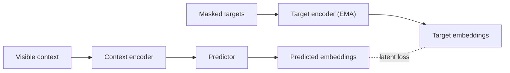

# Awesome Medical JEPA

A curated list of papers and code that use **Joint-Embedding Predictive Architectures (JEPA)**, including I-JEPA, V-JEPA and LeJEPA, 
for self-supervised learning in medicine and healthcare: medical imaging, physiological signals, surgical video, EHR and molecular biology.

**[🌐 Website](https://big-matrix-r-and-d-lab.github.io/Awesome-Medical-JEPA/)** &nbsp;·&nbsp; **[Browse papers](#contents)** &nbsp;·&nbsp; **[What is a JEPA?](#what-is-a-jepa)** &nbsp;·&nbsp; **[Add a paper](../../issues/new?template=add-paper.yml)** &nbsp;·&nbsp; **[Contribute](#contributing)**

## What is a JEPA?

A JEPA learns representations by *predicting in latent space*. A context encoder embeds a visible part of the input. A predictor then estimates the embeddings of masked or future target regions, which a separate target encoder (typically an EMA of the context encoder) produces. The model never reconstructs pixels or raw signal values, so it can concentrate on semantic structure and ignore low-level noise. That makes it a natural fit for medical data, where much of the variance in the raw input is acquisition noise.

The original formulations are I-JEPA for images and V-JEPA for video; they are listed under [Foundations](#-foundations).

## How to read this list

| Inclusion type | Meaning | How it appears below |
| --- | --- | --- |
| **Direct Medical JEPA** | Applies or extends a JEPA objective on medical or biomedical data. | Model name only |
| **JEPA-inspired Medical** | Adapts JEPA ideas (e.g. latent feature prediction) without being a named JEPA, or benchmarks JEPA against other objectives. | 🔸 after the model name |
| **Foundational JEPA** | General-domain architectures and theory that medical JEPA work builds on. | Listed under [Foundations](#-foundations) |

> [!NOTE]
> The **Code** column links only to **official** implementations released by the authors, with live GitHub stars. Third-party re-implementations are deliberately not listed, and `—` means no official code was located at curation time. Venues shown as *arXiv* or *bioRxiv* are preprints that have not (yet) been peer reviewed.

## At a glance

**{{TOTAL}}** papers &nbsp;·&nbsp; **{{WITH_CODE}}** with official code &nbsp;·&nbsp; **{{AREA_COUNT}}** research areas

{{YEARS}}

## Contents

{{TOC}}
